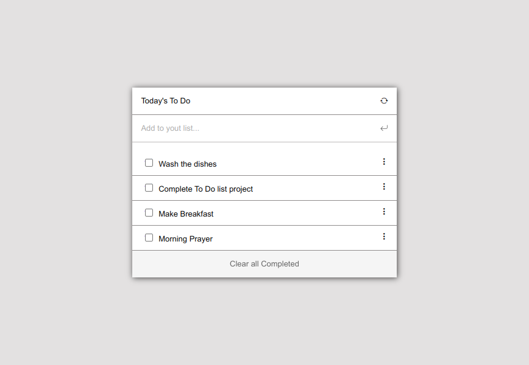

# To do list
> "To-do list" is a tool that helps to organize your day. It simply lists the things that you need to do and allows you to mark them as complete
>[more about Webpack](https://webpack.js.org/)


## Built With 

- HTML
- CSS 
- Javascript
- ES6
- Webpack
- Bootstrap Icon

## Project List

- Project 1: List structure.
- Project 2: Interactive list.
- Project 3: Add and remove items.

# Setup

1. Clone the repository: ```git clone git+https://github.com/Bateyjosue/to-do-list-webpack.git```

Note: Make sure you have [nodejs](https://nodejs.org/en/download/) installed and npm as wel. then, run
2. ```npm install``` to install the dependencies

3. After install project dependencies you can now run the following command ```nmp dev``` or ```npm run dev``` to run the development mode.

4. Finally, run the following command ```npm start``` or ```npm run start``` and then open your apps in the browser in the address ```http://localhost:8080/```
## Authors

👤 **Josh Batey**

- GitHub: [@Bateyjosue](https://github.com/Bateyjosue)
- Twitter: [@JosueBatey](https://twitter.com/josuebatey)
- LinkedIn: [Josue (Josh) Batey](https://www.linkedin.com/in/josue-ishara/)

## 🤝 Contributing

Contributions, issues, and feature requests are welcome!

## Show your support

Give a ⭐️ if you like this project!

